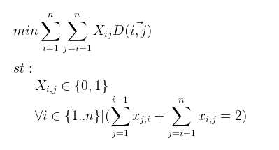
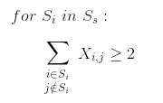

# Traveling Salesman Problem Visualizer 

This project is a TSP visualizer that uses Integer Linear Programming (branch and bound method) to find the shortest tour that visits each city only once. Typically, the path will not be found in the first iteration, so we need to solve the subtour relaxation by finding relevant constraints, since the number of possible combinations is exponential. We do a DFS to find the subtours and use that information to form new constraints. We repeat this process until a tour is a found.

While the program is running, it is also solving for the dual of the problem (primal is to minimize the distance, dual is to maximze the width (distance) of the city). It uses the answer of the subtour relaxation of the primal to create new constraints for the dual.

In short, the relationship of the dual to the primal can be summed up as a different view of the objective function. For example, if we wanted to maximize the space of a storage unit as our objective function, the dual would be to minimize the amount of space in the storage unit. Mathematically, each variable in the primal LP becomes the constraint in the dual. Each constraint in the primal becomes a variable in the dual. It works beautifully that the variables in our dual happen to be the size of each city!

## The Primal (finding the tour)
Let's say we have number of cities n and for two cities, i and j, we let x(i,j) be whether or not we choose to use the city. If the city is used: x(i,j) = 1. If it is not: x(i,j) = 0. To calculate the length of the tour, we calculate the distance of each city and all possible paths from that city and whether or not the city is used. We observe that for every city and its corresponding possible paths, it will sum up to 2 because we have to enter and exit each city exactly once.
```
It can be written as:
```


However, this will not find you the tour when the LP solver is used. Because we are trying to minimize distances, it will calculate subtours, or separate groupings of cities, in the first iteration. We want to force the subtours to connect to each other, and to do that, we add new constraints. For every city in a subtour that is added to another city outside of that subtour, the new inequality must be greater than or equal to 2.
```
It can be written as:
```


We then keep iterating until we have no subtours left. Keep in mind that past constraints must be kept in new iterations.

## The Dual (size of the city)
After the first iteration is solved in the primal problem, we use the subtours to add additional variables (Ys) to the dual problem. The additional variables....etc

## Resources
http://www.math.uwaterloo.ca/tsp/methods/opt/zone.htm

https://www.epfl.ch/labs/dcg/wp-content/uploads/2018/10/13-TSP.pdf


